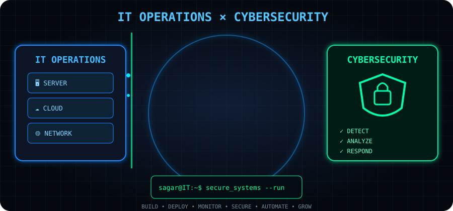

<div align="center">


</div>

---

I'm an **IT professional with 8+ years of hands-on experience** across **IT Operations, ERP/CRM Management, Web Development, Server & System Administration, and Digital Operations**.

I work at the intersection of **technology, business operations, and digital transformation** — from managing IT infrastructure and business applications to developing web solutions, automating workflows, and supporting digital initiatives.

I'm continuously expanding my expertise in **IT Management, Cybersecurity, Digital Forensics, Cloud Computing, AI, Automation, and Network Security**.

### 🎯 Current Focus

`IT Management` • `Cybersecurity` • `Digital Forensics` • `Cloud` • `AI` • `Automation` • `Network Security`

<br>

<div align="center">



</div>

<br>
<div align="center">


</div>

---

## 🧑‍💻 About Me

* 💼 **8+ Years** of IT & Digital Operations experience
* 🖥️ IT Operations, System & Server Administration
* ⚙️ ERP / CRM Implementation & Management
* 🌐 PHP & Laravel Web Development
* 🗄️ MySQL & Database Management
* ☁️ Cloud Technologies — AWS & Google Cloud
* 🔌 API Integration & Business Application Management
* 🌐 Networking & Infrastructure Support
* 🔐 Exploring Cybersecurity & Digital Forensics
* 🤖 AI Tools, Automation & Digital Transformation
* 🎨 Video Editing, Graphic Design & Digital Media
* 📱 Social Media & Digital Operations
* 📈 Interested in IT Leadership & Technology Management

---

# 🛠️ Technical Skills

### 💻 Development


### 🗄️ Database & Backend


### ☁️ Cloud & Infrastructure


### 🌐 Networking & IT Operations


**IT Operations • System Administration • Server Management • Network Troubleshooting • ERP Support • CRM Management • Backup & Recovery • User & Access Management • Application Support • API Integration**

### 🎨 Design & Creative Technology


### 🤖 AI & Automation

**AI Tools • Generative AI • AI-assisted Workflows • Prompt Engineering • Process Automation • Digital Transformation**

---

# 🏢 Professional Expertise

```text
IT Operations
├── Infrastructure & System Administration
├── Server Management
├── Network Support & Troubleshooting
├── User & Access Management
└── IT Support & Vendor Coordination

Business Applications
├── ERP Management
├── CRM Management
├── HR & Payroll Systems
├── Business Process Automation
└── API Integrations

Web & Software
├── PHP
├── Laravel
├── CodeIgniter
├── WordPress
├── MySQL
└── Custom Business Applications

Digital Operations
├── Website Management
├── Social Media Management
├── Video Production
├── Graphic Design
└── Digital Marketing Technology

Emerging Technologies
├── Cybersecurity
├── Digital Forensics
├── Cloud Computing
├── AI & Automation
└── Network Security
```

---

# 🚀 What I Do

🔹 Manage and support **IT infrastructure & business applications**

🔹 Develop and maintain **PHP / Laravel / WordPress-based applications**

🔹 Manage **ERP, CRM and internal business systems**

🔹 Handle **servers, databases, websites and technical operations**

🔹 Integrate **APIs and automate business workflows**

🔹 Troubleshoot **systems, networks and application issues**

🔹 Work with **cloud technologies and modern IT tools**

🔹 Create **digital content, graphics and video solutions**

🔹 Explore **AI-powered automation and productivity solutions**

---

# 📚 Currently Learning

* 🔐 Cybersecurity & Network Security
* 🛡️ FortiGate Firewall
* 🔎 Digital Forensics & DFIR
* ☁️ Cloud Infrastructure
* 🤖 AI & Intelligent Automation
* ⚙️ DevOps & Infrastructure Automation
* 🏢 IT Management & Leadership

---

# 📊 GitHub Statistics

<div align="center">


</div>

---

# 💡 Developer Mindset

> **"Technology is not just about writing code — it's about solving problems, improving processes, and creating measurable value."**

I believe in continuous learning, practical problem-solving, automation, and using technology to make business operations **simpler, faster, and more scalable**.

---

# 🤝 Let's Connect

<div align="center">

[](https://www.linkedin.com/in/sagar-parghi-21524a11a/)

[](https://www.instagram.com/the_sp_shaab/)

[](https://www.youtube.com/@SP05)

[](https://www.facebook.com/profile.php?id=100003292423768)

[](https://in.pinterest.com/sagarparghi1994/)

[](mailto:sagar.parghi1994@gmail.com)

</div>

---

# 👀 Profile Visitors

<div align="center">


</div>

---

### ⭐ If you find my work useful, feel free to explore my repositories and connect with me.

<!-- Proudly created and customized for Sagar Parghi -->
